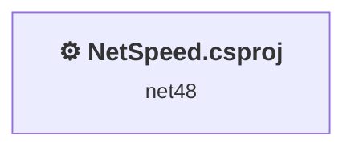
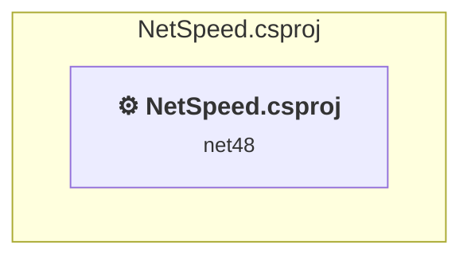

# Projects and dependencies analysis

This document provides a comprehensive overview of the projects and their dependencies in the context of upgrading to .NETCoreApp,Version=v10.0.

## Table of Contents

- [Executive Summary](#executive-Summary)
  - [Highlevel Metrics](#highlevel-metrics)
  - [Projects Compatibility](#projects-compatibility)
  - [Package Compatibility](#package-compatibility)
  - [API Compatibility](#api-compatibility)
  - [Binding Redirect Configuration](#binding-redirect-configuration)
- [Aggregate NuGet packages details](#aggregate-nuget-packages-details)
- [Top API Migration Challenges](#top-api-migration-challenges)
  - [Technologies and Features](#technologies-and-features)
  - [Most Frequent API Issues](#most-frequent-api-issues)
- [Projects Relationship Graph](#projects-relationship-graph)
- [Project Details](#project-details)

  - [InterfaceTrafficWatch\NetSpeed.csproj](#interfacetrafficwatchnetspeedcsproj)

## Executive Summary

### Highlevel Metrics

| Metric | Count | Status |
| :--- | :---: | :--- |
| Total Projects | 1 | All require upgrade |
| Total NuGet Packages | 0 | All compatible |
| Total Code Files | 10 |  |
| Total Code Files with Incidents | 10 |  |
| Total Lines of Code | 1489 |  |
| Total Number of Issues | 1293 |  |
| Estimated LOC to modify | 1291+ | at least 86,7% of codebase |

### Projects Compatibility

| Project | Target Framework | Difficulty | Package Issues | API Issues | Binding Issues | Est. LOC Impact | Description |
| :--- | :---: | :---: | :---: | :---: | :---: | :---: | :--- |
| [InterfaceTrafficWatch\NetSpeed.csproj](#interfacetrafficwatchnetspeedcsproj) | net48 | 🟡 Medium | 0 | 1291 | 0 | 1291+ | ClassicWinForms, Sdk Style = False |

### Package Compatibility

| Status | Count | Percentage |
| :--- | :---: | :---: |
| ✅ Compatible | 0 | 0,0% |
| ⚠️ Incompatible | 0 | 0,0% |
| 🔄 Upgrade Recommended | 0 | 0,0% |
| ***Total NuGet Packages*** | ***0*** | ***100%*** |

### API Compatibility

| Category | Count | Impact |
| :--- | :---: | :--- |
| 🔴 Binary Incompatible | 1120 | High - Require code changes |
| 🟡 Source Incompatible | 171 | Medium - Needs re-compilation and potential conflicting API error fixing |
| 🔵 Behavioral change | 0 | Low - Behavioral changes that may require testing at runtime |
| ✅ Compatible | 1139 |  |
| ***Total APIs Analyzed*** | ***2430*** |  |

## Aggregate NuGet packages details

| Package | Current Version | Suggested Version | Projects | Description |
| :--- | :---: | :---: | :--- | :--- |

## Top API Migration Challenges

### Technologies and Features

| Technology | Issues | Percentage | Migration Path |
| :--- | :---: | :---: | :--- |
| Windows Forms | 1120 | 86,8% | Windows Forms APIs for building Windows desktop applications with traditional Forms-based UI that are available in .NET on Windows. Enable Windows Desktop support: Option 1 (Recommended): Target net9.0-windows; Option 2: Add <UseWindowsDesktop>true</UseWindowsDesktop>; Option 3 (Legacy): Use Microsoft.NET.Sdk.WindowsDesktop SDK. |
| GDI+ / System.Drawing | 168 | 13,0% | System.Drawing APIs for 2D graphics, imaging, and printing that are available via NuGet package System.Drawing.Common. Note: Not recommended for server scenarios due to Windows dependencies; consider cross-platform alternatives like SkiaSharp or ImageSharp for new code. |
| Legacy Configuration System | 2 | 0,2% | Legacy XML-based configuration system (app.config/web.config) that has been replaced by a more flexible configuration model in .NET Core. The old system was rigid and XML-based. Migrate to Microsoft.Extensions.Configuration with JSON/environment variables; use System.Configuration.ConfigurationManager NuGet package as interim bridge if needed. |
| Windows Forms Legacy Controls | 2 | 0,2% | Legacy Windows Forms controls that have been removed from .NET Core/5+ including StatusBar, DataGrid, ContextMenu, MainMenu, MenuItem, and ToolBar. These controls were replaced by more modern alternatives. Use ToolStrip, MenuStrip, ContextMenuStrip, and DataGridView instead. |

### Most Frequent API Issues

| API | Count | Percentage | Category |
| :--- | :---: | :---: | :--- |
| T:System.Windows.Forms.Label | 134 | 10,4% | Binary Incompatible |
| T:System.Windows.Forms.TextBox | 51 | 4,0% | Binary Incompatible |
| T:System.Windows.Forms.ToolStripMenuItem | 49 | 3,8% | Binary Incompatible |
| T:System.Windows.Forms.Button | 35 | 2,7% | Binary Incompatible |
| T:System.Windows.Forms.TableLayoutPanel | 30 | 2,3% | Binary Incompatible |
| T:System.Drawing.Bitmap | 27 | 2,1% | Source Incompatible |
| P:System.Windows.Forms.Control.Name | 25 | 1,9% | Binary Incompatible |
| P:System.Windows.Forms.Control.Size | 22 | 1,7% | Binary Incompatible |
| T:System.Windows.Forms.Application | 21 | 1,6% | Binary Incompatible |
| P:System.Windows.Forms.Control.Location | 21 | 1,6% | Binary Incompatible |
| T:System.Windows.Forms.DockStyle | 21 | 1,6% | Binary Incompatible |
| P:System.Windows.Forms.Control.TabIndex | 20 | 1,5% | Binary Incompatible |
| T:System.Drawing.Image | 20 | 1,5% | Source Incompatible |
| P:System.Windows.Forms.Label.Text | 19 | 1,5% | Binary Incompatible |
| P:System.Windows.Forms.Control.Height | 17 | 1,3% | Binary Incompatible |
| T:System.Windows.Forms.Padding | 16 | 1,2% | Binary Incompatible |
| T:System.Windows.Forms.SizeType | 16 | 1,2% | Binary Incompatible |
| P:System.Windows.Forms.Application.UserAppDataRegistry | 16 | 1,2% | Binary Incompatible |
| T:System.Windows.Forms.PictureBox | 15 | 1,2% | Binary Incompatible |
| T:System.Windows.Forms.ComboBox | 15 | 1,2% | Binary Incompatible |
| T:System.Drawing.SolidBrush | 15 | 1,2% | Source Incompatible |
| T:System.Windows.Forms.Control.ControlCollection | 14 | 1,1% | Binary Incompatible |
| P:System.Windows.Forms.Control.Controls | 14 | 1,1% | Binary Incompatible |
| M:System.Windows.Forms.Control.ControlCollection.Add(System.Windows.Forms.Control) | 14 | 1,1% | Binary Incompatible |
| T:System.Windows.Forms.MouseEventHandler | 14 | 1,1% | Binary Incompatible |
| T:System.Windows.Forms.FormBorderStyle | 12 | 0,9% | Binary Incompatible |
| P:System.Windows.Forms.TextBox.Text | 12 | 0,9% | Binary Incompatible |
| T:System.Drawing.ContentAlignment | 12 | 0,9% | Source Incompatible |
| T:System.Windows.Forms.ToolStripSeparator | 12 | 0,9% | Binary Incompatible |
| T:System.Windows.Forms.ContextMenuStrip | 12 | 0,9% | Binary Incompatible |
| P:System.Windows.Forms.Control.Width | 12 | 0,9% | Binary Incompatible |
| T:System.Drawing.Font | 11 | 0,9% | Source Incompatible |
| M:System.Windows.Forms.Label.#ctor | 11 | 0,9% | Binary Incompatible |
| T:System.Windows.Forms.NotifyIcon | 10 | 0,8% | Binary Incompatible |
| T:System.Windows.Forms.Timer | 10 | 0,8% | Binary Incompatible |
| T:System.Windows.Forms.AutoScaleMode | 9 | 0,7% | Binary Incompatible |
| T:System.Windows.Forms.DialogResult | 8 | 0,6% | Binary Incompatible |
| T:System.Drawing.FontStyle | 8 | 0,6% | Source Incompatible |
| F:System.Windows.Forms.SizeType.Percent | 8 | 0,6% | Binary Incompatible |
| P:System.Windows.Forms.Control.BackgroundImage | 8 | 0,6% | Binary Incompatible |
| P:System.Windows.Forms.Control.Margin | 7 | 0,5% | Binary Incompatible |
| F:System.Windows.Forms.DockStyle.Fill | 7 | 0,5% | Binary Incompatible |
| P:System.Windows.Forms.Control.Dock | 7 | 0,5% | Binary Incompatible |
| T:System.Windows.Forms.TableLayoutControlCollection | 7 | 0,5% | Binary Incompatible |
| P:System.Windows.Forms.TableLayoutPanel.Controls | 7 | 0,5% | Binary Incompatible |
| M:System.Windows.Forms.TableLayoutControlCollection.Add(System.Windows.Forms.Control,System.Int32,System.Int32) | 7 | 0,5% | Binary Incompatible |
| P:System.Windows.Forms.Label.AutoSize | 7 | 0,5% | Binary Incompatible |
| P:System.Windows.Forms.ToolStripItem.Text | 7 | 0,5% | Binary Incompatible |
| P:System.Windows.Forms.ToolStripItem.Size | 7 | 0,5% | Binary Incompatible |
| P:System.Windows.Forms.ToolStripItem.Name | 7 | 0,5% | Binary Incompatible |

## Projects Relationship Graph

Legend:
📦 SDK-style project
⚙️ Classic project

## Project Details

### InterfaceTrafficWatch\NetSpeed.csproj

#### Project Info

- **Current Target Framework:** net48
- **Proposed Target Framework:** net10.0-windows
- **SDK-style**: False
- **Project Kind:** ClassicWinForms
- **Dependencies**: 0
- **Dependants**: 0
- **Number of Files**: 14
- **Number of Files with Incidents**: 10
- **Lines of Code**: 1489
- **Estimated LOC to modify**: 1291+ (at least 86,7% of the project)

#### Dependency Graph

Legend:
📦 SDK-style project
⚙️ Classic project

### API Compatibility

| Category | Count | Impact |
| :--- | :---: | :--- |
| 🔴 Binary Incompatible | 1120 | High - Require code changes |
| 🟡 Source Incompatible | 171 | Medium - Needs re-compilation and potential conflicting API error fixing |
| 🔵 Behavioral change | 0 | Low - Behavioral changes that may require testing at runtime |
| ✅ Compatible | 1139 |  |
| ***Total APIs Analyzed*** | ***2430*** |  |

#### Project Technologies and Features

| Technology | Issues | Percentage | Migration Path |
| :--- | :---: | :---: | :--- |
| Legacy Configuration System | 2 | 0,2% | Legacy XML-based configuration system (app.config/web.config) that has been replaced by a more flexible configuration model in .NET Core. The old system was rigid and XML-based. Migrate to Microsoft.Extensions.Configuration with JSON/environment variables; use System.Configuration.ConfigurationManager NuGet package as interim bridge if needed. |
| Windows Forms Legacy Controls | 2 | 0,2% | Legacy Windows Forms controls that have been removed from .NET Core/5+ including StatusBar, DataGrid, ContextMenu, MainMenu, MenuItem, and ToolBar. These controls were replaced by more modern alternatives. Use ToolStrip, MenuStrip, ContextMenuStrip, and DataGridView instead. |
| GDI+ / System.Drawing | 168 | 13,0% | System.Drawing APIs for 2D graphics, imaging, and printing that are available via NuGet package System.Drawing.Common. Note: Not recommended for server scenarios due to Windows dependencies; consider cross-platform alternatives like SkiaSharp or ImageSharp for new code. |
| Windows Forms | 1120 | 86,8% | Windows Forms APIs for building Windows desktop applications with traditional Forms-based UI that are available in .NET on Windows. Enable Windows Desktop support: Option 1 (Recommended): Target net9.0-windows; Option 2: Add <UseWindowsDesktop>true</UseWindowsDesktop>; Option 3 (Legacy): Use Microsoft.NET.Sdk.WindowsDesktop SDK. |

